# 🔥 CopilotForge

> One command. A fully-configured AI team in your repo.

CopilotForge turns a plain-English description of your project into a working set of AI-powered tools — all inside your repo. You tell it what you're building, answer a few questions, and it creates everything: coding assistants that know your stack, code review checklists, test helpers, ready-to-use code recipes, and a memory system that gets smarter over time.

It creates **skills** (instruction files for your AI), **agents** (AI team members defined in markdown), **recipes** (copy-paste code examples), and a **memory** system (plain-text files that remember your decisions). "Scaffolding" just means auto-generating these files into your project.

**The files it creates have zero dependencies.** The skills, agents, and memory files are plain markdown — nothing to install, nothing to run. Node.js is only needed for the `npx copilotforge init` command.

---

## What It Does (30-Second Version)

**Before CopilotForge:**
> "I want AI help with my Next.js app but I don't know where to start with skills, agents, or configuration."

**After CopilotForge:**
> You answered a few questions. Now your repo has a code reviewer that knows TypeScript conventions, a test writer that uses Jest, copy-paste code recipes for Express and Prisma, and a memory system that remembers your decisions. All from one conversation.

---

## What You'll Need

- **An AI coding assistant** — [GitHub Copilot](https://github.com/features/copilot), [Claude Code](https://claude.ai), [Cursor](https://cursor.sh), or similar
- **A code project** — new or existing, any language (even an empty folder works)
- **Git** — recommended but not required (Git tracks changes to your files; if you don't have it, grab it from [git-scm.com](https://git-scm.com))

For the one-command path: **Node.js 18+** (just to run `npx copilotforge init`). For the manual copy path: nothing at all.

> 💡 **For cookbook recipes only:** If you want to run the code examples, you'll need Node.js 18+ (for TypeScript recipes) or Python 3.10+ (for Python recipes). CopilotForge itself needs nothing installed.

---

## Quick Start

### Option A — One Command (Recommended)

```bash
cd your-project
npx copilotforge
```

This launches the **conversational wizard** — answer 6 questions about your project and CopilotForge scaffolds everything automatically.

> 💡 **Direct init (skip wizard):** `npx copilotforge init` creates all files immediately with defaults. Use `--minimal` for planner skill only (2 files). Use `--oracle-prime` for Oracle Prime reasoning framework only (3 files). **Preview first?** Add `--dry-run` to see what would be created.
>
> **Undo mistakes?** `npx copilotforge rollback` restores files from before the last init/upgrade.
>
> **Skip prompts?** Use `npx copilotforge init --yes` for autonomous mode (auto-overwrite, auto-commit, perfect for CI/scripting)

### Option B — Manual Copy

If you prefer not to use npm, copy the `.github/skills/planner/` folder from this repo into your project:

```
your-project/
  .github/
    skills/
      planner/
        SKILL.md      ← this is the magic file
```

> 💡 If your project doesn't have a `.github/` folder yet, just create it.

### Option C — GitHub Template

Click **"Use this template"** on this repo's GitHub page to create a new repo with CopilotForge pre-installed.

### Then...

Open your AI assistant and say:

```
set up my project
```

Other phrases that work: `forge`, `copilot forge`, `plan my project`, `scaffold my repo`, `bootstrap this repo`.

> 📝 **Windows users:** The examples above use forward slashes (`/`) in file paths. On Windows, use backslashes (`\`) — or just use PowerShell, which accepts both.

The wizard asks six questions about your project, then scaffolds everything automatically. Here's what to expect:

| # | Question | Example Answer |
|---|----------|----------------|
| 1 | **What are you building?** | "A task management app with a REST API and React frontend" |
| 2 | **What's your stack?** | "TypeScript, Next.js, Prisma, PostgreSQL" |
| 3 | **Do you want memory?** | "yes" *(so it remembers your choices next time)* |
| 4 | **Do you want test automation?** | "yes" *(creates a test-writing helper)* |
| 5 | **What's your experience level?** | "beginner" *(adds extra comments to everything)* |
| 6 | **Want to add any advanced features?** | "none" *(or: task automation, auto-experiments, etc.)* |

You'll see a summary of your answers. Say "yes" to confirm, or change anything before it starts building.

### 🏠 Command Center — Your Project at a Glance

Run `npx copilotforge status` to see a terminal dashboard:

```
📋 Plan       5/12 tasks done — Next: add-auth
🧠 Memory     3 decisions · 2 patterns
🔧 Skills     planner · code-review · testing
🤖 Agents     planner · reviewer · tester
📊 Git        branch: main · 8 commits today
```

Inspired by [command-center-lite](https://github.com/brittanyellich/command-center-lite) — but terminal-first. No GUI, no dependencies. Everything you need in one `npx` command.

Want a custom dashboard? See `cookbook/command-center.ts` for an extensible recipe with a widget system you can plug your own data sources into.

### 🌐 Live Dashboard — Browser View

For a richer view, run:

```bash
npx copilotforge dashboard
```

This starts a local server and opens a live browser dashboard at `http://localhost:3731`. It shows:

- **Plan progress** — tasks done vs. remaining with a progress bar
- **Ralph status** — whether the Ralph Loop is running and what it's doing
- **Project health** — checklist of key files (FORGE.md, IMPLEMENTATION_PLAN.md, etc.)
- **Recent commits** — last 5 git commits at a glance
- **Start Build / Pause buttons** — launch or pause the Ralph Loop from your browser

The dashboard auto-refreshes every 4 seconds. No install required — it's built into the CLI.

### 🔄 The Ralph Loop — Let AI Build Your Project

Select **Task automation** in Question 6 and CopilotForge generates two things:

1. **`IMPLEMENTATION_PLAN.md`** — A step-by-step build plan derived from your project description
2. **`cookbook/task-loop.ts`** (or `.py`) — The Ralph Loop engine (the code that drives it)

The Ralph Loop reads your plan, picks the next task, implements it, runs validation, commits the result, and moves to the next task. No human intervention between steps.

**Example flow:**
```
You: "A REST API for a pet adoption platform, TypeScript + Express + Prisma"
↓
IMPLEMENTATION_PLAN.md (12 tasks: setup → models → routes → auth → tests)
↓
Ralph Loop: picks "setup-express" → implements → validates → commits → picks "setup-prisma" → ...
↓
Working project with 12 commits, each building on the last
```

You can also edit the plan manually — add tasks, reorder them, or mark tasks as done. Ralph picks up where you left off.

**Starting the Ralph Loop:**

```bash
# Persistent — runs continuously, polls every 10 seconds
npx copilotforge watch

# One-shot — runs through pending tasks once, then exits
npx copilotforge run
```

Or use the **Start Build** button in the live dashboard (`npx copilotforge dashboard`).

### The Complete Flow

1. **Describe** — Say "set up my project" and answer six questions
2. **Generate** — The wizard creates your plan in `IMPLEMENTATION_PLAN.md`  
3. **Execute** — Say "run the plan" and watch your project get built, task by task

Each task is implemented, validated, and committed automatically. Failed tasks are marked `[!]` so you can review them. Say "continue the plan" to resume where you left off.

### What You Get

In about a minute, your repo gets a full set of AI-ready files:

| What | Where | What It Does |
|------|-------|--------------|
| 🎯 **Skills** | `.github/skills/` | Rules and instructions that teach your AI assistant how to work in this project |
| 🤖 **Agents** | `.copilot/agents/` | AI team members — a code reviewer, a test writer, etc. |
| 📖 **Recipes** | `cookbook/` | Copy-paste code examples for your specific stack |
| 🧠 **Memory** | `forge-memory/` | Decision log and conventions — so the AI remembers what you decided |
| 📋 **Control panel** | `FORGE.md` | One file that shows everything that was set up |
| 🔮 **Oracle Prime** | `.github/skills/oracle-prime/` | Precision reasoning — Bayesian scenario analysis, risk assessment, decision support |

**Open `FORGE.md` to see the full picture.**

### From Setup to Building

After the wizard scaffolds your project, it outputs a **ready-to-use prompt** you can copy into any AI assistant. Three ways to start building:

1. **Copy the generated prompt** — customized with your project type, stack, and first goal
2. **Use the one-liner:** "Read FORGE.md and let's start building"
3. **Just start talking** — describe what you want to build; the AI reads FORGE.md automatically

This bridges the gap between describing your project and actually building it.

> **Stuck?** Jump to [Troubleshooting](docs/FAQ.md#troubleshooting) or open an issue in this repo.

---

## Not Sure Where to Start?

| I want to... | Go here |
|--------------|---------|
| **Set up my project with AI** | [Quick Start](#quick-start) (above) — one command does everything |
| **Browse code recipes** | [Cookbook Cheatsheet](cookbook/CHEATSHEET.md) — find a recipe by goal |
| **Understand what I actually need** | [What Should I Use?](docs/WHAT-TO-USE.md) — pick your path |
| **Follow a step-by-step tutorial** | [Getting Started](docs/GETTING-STARTED.md) — full walkthrough |
| **Understand how it works inside** | [How It Works](docs/HOW-IT-WORKS.md) — the technical details |
| **See why things are built this way** | [Decisions & Architecture](docs/DECISIONS-AND-ARCHITECTURE.md) — key choices, build paths, and code map |

## Installation

| Method | Command | Best For |
|--------|---------|----------|
| **npx** (recommended) | `npx copilotforge` | Conversational wizard — answer 6 questions, get everything |
| **npx init** | `npx copilotforge init` | Direct setup — skills, cookbook, memory, docs |
| **npx minimal** | `npx copilotforge init --minimal` | Planner skill only (2 files) |
| **npx oracle-prime** | `npx copilotforge init --oracle-prime` | Oracle Prime reasoning framework only (3 files) |
| **Manual copy** | Copy `.github/skills/planner/` | No Node.js, airgapped environments |
| **GitHub Template** | Click "Use this template" | Starting a brand new project |

### Health Check

```bash
npx copilotforge doctor
```

### MCP Server — AI Client Integration

Connect CopilotForge to Claude Desktop, VS Code Copilot, Cursor, or Zed:

```bash
npx copilotforge mcp
```

This starts an MCP server exposing `init`, `doctor`, `status`, and `rollback` as tools. See [MCP Setup Guide](docs/MCP-SETUP.md) for client-specific configuration.

### Examples Gallery

Browse and clone starter projects:

```bash
npx copilotforge examples           # List all examples
npx copilotforge examples preview pcf-rating  # Preview without cloning
npx copilotforge examples pcf-rating          # Clone to ./pcf-rating/
```

### Rollback — Undo Init/Upgrade

```bash
npx copilotforge rollback            # Interactive — pick a snapshot
npx copilotforge rollback --latest   # Restore most recent snapshot
npx copilotforge rollback --list     # Show available snapshots
```

### Dashboard

```bash
npx copilotforge dashboard
```

Opens the live browser dashboard at `http://localhost:3731`.

### Uninstall

```bash
npx copilotforge uninstall
```

### Watch — Persistent Plan Executor

```bash
npx copilotforge watch
```

Runs a persistent terminal process that polls your `IMPLEMENTATION_PLAN.md` every 10 seconds, executes the next pending task, and marks it done or failed. Immune to Copilot Chat interruptions — it lives in a terminal, not a chat turn.

```bash
npx copilotforge watch --interval 30   # Poll every 30 seconds
npx copilotforge watch --health        # Check if watch is running
npx copilotforge watch --log-file watch.log  # Append logs to a file
```

📖 **[Full watch documentation →](docs/WATCH.md)**

### Run — One-Shot Plan Executor

```bash
npx copilotforge run
```

Checks your setup, shows a table of pending tasks, then launches the task executor once and exits when done. Good for a single pass through the plan.

```bash
npx copilotforge run --dry-run        # Preview pending tasks without executing
npx copilotforge run --task <id>      # Run a single task by ID and exit
```

> 💡 **watch vs run:** Use `watch` for continuous autonomous building (leaves a process running). Use `run` for a single controlled pass or CI pipelines.

---

## What Gets Created

Here's a real example of what your repo looks like after running CopilotForge on a TypeScript/Next.js/Prisma project:

```
your-project/
├── .copilot/
│   └── agents/
│       ├── planner.md          # The wizard (already set up)
│       ├── reviewer.md         # Reviews your code, knows your conventions
│       ├── oracle-prime.md     # Precision reasoning for complex decisions
│       └── tester.md           # Writes tests using Jest patterns
│
├── .github/
│   └── skills/
│       ├── planner/
│       │   └── SKILL.md        # The wizard itself
│       ├── my-app-conventions/
│       │   └── SKILL.md        # Your project's coding rules
│       ├── code-review/
│       │   └── SKILL.md        # How to review code in your stack
│       └── testing/
│           └── SKILL.md        # How to write tests in your stack
│
├── cookbook/
│   ├── README.md               # Recipe index
│   ├── error-handling.ts       # Error patterns for TypeScript
│   ├── api-client.ts           # HTTP client with retry and auth
│   ├── auth-middleware.ts      # Express JWT auth
│   ├── db-query.ts             # Prisma CRUD patterns
│   ├── route-handler.ts        # Express routes with validation
│   └── ...                     # More recipes based on your stack
│
├── forge-memory/
│   ├── decisions.md            # What was decided and why
│   ├── patterns.md             # Coding conventions for this project
│   ├── preferences.md          # Your settings (verbosity, etc.)
│   └── history.md              # Session log
│
└── FORGE.md                    # Your control panel — start here
```

---

## Build Paths — Which Path Is Right for You?

When you run `npx copilotforge init`, CopilotForge detects what you're building and selects the right **Build Path** — a pre-configured scaffold optimised for your use case.

| Path | Use Case | Best For |
|------|----------|----------|
| **A — Standard App** | General web apps, APIs, CLIs | Most projects |
| **B — Power Platform (Canvas App)** | Microsoft Canvas Apps + Power Fx | Power Platform makers |
| **C — Power Platform (Copilot Studio)** | Copilot Studio agents | Bot/agent builders |
| **D — Power Platform (Power Automate)** | Flow automation | Process automation |
| **E — Power Platform (PCF)** | Custom controls | Advanced Power Platform devs |
| **F — Power Platform (Full Suite)** | Mixed Power Platform work | Power Platform teams |
| **G — Data & Analytics** | Power BI, dashboards, ML | Data engineers |
| **H — DevOps & Infrastructure** | CI/CD, IaC, cloud | DevOps teams |
| **I — Agentic / AI-Native** | MCP, LLM apps, agents | AI developers |
| **J — Trading & Finance** | Algo trading, quant | Finance/trading devs |

CopilotForge auto-detects your path from keywords in your project description. You can also set it explicitly with `--path <letter>` on `init`.

> 💡 **Power Platform users:** Paths B–F include Power Platform-specific skills, agent definitions, and cookbook recipes. The wizard asks three extra questions to configure your environment (tenant ID, environment name, solution publisher prefix).

---

## How It Works (Plain English)

Here's the whole flow:

1. **You describe your project** in one or two sentences.
2. **The wizard asks four more questions** — your stack, whether you want memory, whether you want test automation, and your experience level.
3. **CopilotForge looks at your project** — it reads your `package.json`, `requirements.txt`, or other config files to understand exactly which frameworks you're using.
4. **It generates everything** — skills, agents, code recipes, memory files, and a control panel. Every file is customized for your stack.
5. **You're ready to go** — start using phrases like "review this code" or "write tests for this module" and your AI assistant already knows your conventions.

On the **second run**, the wizard remembers your previous answers. Instead of asking all six questions again, it shows you what it knows and asks what you'd like to change. The more you use it, the less setup you need.

---

## The Six Questions

Here's exactly what the wizard asks and what each answer controls.

### Question 1 — What Are You Building?

> *"Describe your project in a sentence or two."*

This sets the theme for everything. The generated skills, agents, and recipes all reference your project description so your AI assistant understands the context.

**Examples:**
- "A REST API for a pet adoption platform"
- "A React dashboard for monitoring CI pipelines"
- "A CLI tool that converts CSV files to JSON"

### Question 2 — What's Your Stack?

> *"List languages, frameworks, and key tools."*

This is the most important answer. CopilotForge uses it to pick the right code recipes, the right test framework, and the right conventions.

**Examples:**
- "TypeScript, Next.js, Prisma, PostgreSQL"
- "Python, FastAPI, SQLAlchemy"
- "Go, Gin, GORM"
- "C#, ASP.NET Core, Entity Framework"

CopilotForge supports **TypeScript, Python, Go, C#, Rust, PHP, Java/Kotlin, Ruby, and Elixir**. It scans your repo for config files (`package.json`, `requirements.txt`, `go.mod`, `.csproj`, `Cargo.toml`, `composer.json`, `pom.xml`/`build.gradle`, `Gemfile`, `mix.exs`) to auto-detect frameworks. The more specific you are, the better the output.

**CopilotForge works with brand-new empty repos.** If no config files are found, the wizard asks you to describe your stack and works from there.

### Question 3 — Memory?

> *"Do you want memory across sessions?"*

If you say **yes** (the default), CopilotForge creates a `forge-memory/` folder that tracks decisions, conventions, and preferences. This means the next time you run the wizard, it already knows your project and skips questions it can answer from memory.

If you say **no**, you still get everything else — you just won't get the memory files.

**All memory is stored locally in your repo** — nothing leaves your machine.

### Question 4 — Test Automation?

> *"Do you want test automation?"*

If you say **yes** (the default), you get a test-writing agent and a testing skill configured for your stack's test framework (Jest for TypeScript, pytest for Python, etc.).

If you say **no**, the tester agent and testing skill are skipped.

### Question 5 — Experience Level?

> *"What's your experience level? beginner / intermediate / advanced"*

This controls how much explanation appears in generated files:

| Level | What You Get |
|-------|--------------|
| **beginner** | Extra comments explaining every section. More examples. Detailed instructions. |
| **intermediate** | Standard detail. Comments on non-obvious parts only. |
| **advanced** | Minimal comments. Just the essentials. |

Default is **beginner**.

### Question 6 — Extras (Optional)?

> *"Want to add any advanced features?"*

Optional add-ons you can generate right now or add later:

- **Task automation** — The Ralph Loop: AI works through your TODO list autonomously (powered by `task-loop.{ext}`)
- **Auto-experiments** (auto-research) — AI tries code changes, measures results, keeps improvements
- **Knowledge wiki** (knowledge-wiki) — Build a searchable personal wiki from your notes
- **CLI hooks** (copilot-hooks) — Automatic actions during Copilot CLI sessions
- **Blog writer** (blog-writer) — Convert PRs into blog posts automatically
- **Template factory** (template-creator) — Generate documentation and templates in bulk
- **PR dashboard** (pr-visualization) — Analytics and charts for your pull requests
- **Copilot Studio** (copilot-studio-guide) — Build enterprise agents with Microsoft Copilot Studio
- **Code Apps** (code-apps-guide) — Create Power Apps using React and TypeScript
- **Custom Agents** (copilot-agents-guide) — Define custom GitHub Copilot agent profiles

Default is **none** — perfectly fine for beginners. If you're intermediate, **task automation** is a great first extra. Advanced users often combine **task automation** with **auto-experiments**.

All extras can be added later via `cookbook/CHEATSHEET.md` without re-running the wizard.

---

## Customizing Your Setup

Everything CopilotForge creates is plain markdown and code files. There's no hidden config — what you see is what you get. Edit anything, anytime.

### Editing FORGE.md

`FORGE.md` is your control panel. It lists every skill, agent, recipe, and memory file in your project. Think of it as a dashboard.

Want to change something? Just edit the file. For example, to update your project description, change the `Description` field in the Project section. The next time the wizard runs, it'll read your changes.

### Adding a Skill

A skill teaches your AI assistant how to handle a specific request. To add one:

1. Create a new folder in `.github/skills/` — for example, `.github/skills/deploy/`
2. Create a `SKILL.md` file inside it
3. Add a description of when the skill should activate and what it should do

```markdown
---
name: "deploy-helper"
description: "Guides deployment steps for this project"
---

## Context
When to use this skill and why it exists.

## Patterns
Step-by-step instructions the AI should follow.

## Examples
Concrete examples of correct output.

## Anti-Patterns
- Things to avoid and why.
```

### Adding an Agent

An agent is an AI team member with a specific job. To add one:

1. Create a new `.md` file in `.copilot/agents/` — for example, `.copilot/agents/api-designer.md`
2. Define its role, scope, and instructions

```markdown
# API Designer

## Role
Design consistent REST API endpoints for this project.

## Scope
- Endpoint naming and URL structure
- Request/response schemas
- Error response format

## System Prompt
You are an API designer. When asked to design an endpoint, follow RESTful
conventions and match the patterns in this project's code-review skill.

## Boundaries
- **I handle:** API design, schema review, endpoint naming
- **I don't handle:** Implementation, testing, deployment
```

### Adding a Recipe

A recipe is a copy-paste code example. To add one:

1. Create a new file in `cookbook/` — for example, `cookbook/caching-example.ts`
2. Start with a header comment explaining what it does
3. Include all imports — no "install this first" surprises
4. Mark integration points with `TODO` comments

```typescript
/**
 * Caching Example — CopilotForge Cookbook Recipe
 *
 * WHAT THIS DOES:
 *   Redis caching layer with TTL and invalidation
 *
 * WHEN TO USE THIS:
 *   When you need to cache API responses or database queries
 *
 * PREREQUISITES:
 *   npm install redis
 */

import { createClient } from "redis";

// TODO: Replace with your Redis connection string
const client = createClient({ url: "redis://localhost:6379" });
```

---

## Memory (Optional)

If you said "yes" to memory (Question 3), your project gets a `forge-memory/` folder with four files:

| File | What It Tracks |
|------|----------------|
| `decisions.md` | What was decided and why — a changelog for your project's direction |
| `patterns.md` | Coding conventions — naming rules, file structure, style preferences |
| `preferences.md` | Your settings — experience level, stack preferences, generation options |
| `history.md` | A session log — when CopilotForge ran and what it did |

**Why this matters:** The next time you run CopilotForge, it reads these files first. Instead of asking all six questions again, it shows what it already knows and only asks about what's changed. Over time, the wizard gets faster because it already knows your project.

Memory is append-only — it never deletes previous entries. If you want to start fresh, rename or delete the `forge-memory/` folder and run the wizard again.

---

## Cookbook Recipes

The `cookbook/` folder contains ready-to-use code recipes for common tasks. Each recipe is a real, runnable code file — not a snippet or a pseudocode example.

### Recipe Categories

| Category | What You Get |
|----------|-------------|
| **Basics** | Hello world, error handling, session management |
| **API & Web** | HTTP clients, auth middleware, route handlers, validation |
| **Data** | Database CRUD, transactions, error handling (Prisma, SQLAlchemy) |
| **Integration** | MCP tool servers, file management, memory reader |
| **Advanced** | Auto-research loops, autonomous development cycles, knowledge wikis |
| **Extensibility** | Copilot CLI hooks, delegation patterns, skill creation |
| **Content** | Blog generators, template creators, PR visualization |

### How to Use a Recipe

1. Open the recipe file in `cookbook/`
2. Read the header comment — it explains what the recipe does
3. Copy the file into your project
4. Search for `TODO` — those are the spots you fill in with your actual values
5. Run it using the instructions in the header

### Available Recipes

**22+ recipes across core categories:**

| Recipe | Languages | What It Does |
|--------|-----------|--------------|
| **hello-world** | TS + PY | Simplest possible Copilot SDK recipe (start here!) |
| **task-loop** | TS + PY | The Ralph Loop: pick task → implement → validate → commit |
| **session-example** | TS + PY | Create sessions, handle timeouts, clean up resources |
| **multiple-sessions** | TS + PY | Managing multiple concurrent Copilot sessions |
| **persisting-sessions** | TS + PY | Save and restore conversations with custom IDs and history |
| **error-handling** | TS + PY | Custom error types, retry with backoff, graceful failure |
| **api-client** | TS + PY | HTTP client with auth, retry, timeout, typed responses |
| **auth-middleware** | TS + PY | JWT authentication and role-based access control |
| **db-query** | TS + PY | ORM patterns — CRUD, transactions, error handling |
| **route-handler** | TS + PY | Web routes with validation and error responses |
| **mcp-server** | TS + PY | Building a tool server for the Copilot ecosystem |
| **memory-reader** | TS + PY | Read and parse CopilotForge memory files programmatically |
| **managing-local-files** | TS + PY | File organization and management patterns |
| **blog-writer** | TS + PY | Multi-step blog generator from PRs and issues |
| **template-creator** | TS + PY | Generate project templates (README, docs, issues) |
| **pr-visualization** | TS + PY | Interactive CLI to visualize PR activity and age |
| **copilot-hooks** | TS + PY | Copilot CLI session hooks for logging and safety checks |
| **auto-research** | TS + PY | Autonomous experiment loops inspired by Karpathy |
| **command-center** | TS + PY | Terminal dashboard showing plan, memory, skills, agents, git status |
| **delegation-example** | TS | How the Planner delegates to focused agents |
| **skill-creation-example** | TS | How to create new skills programmatically |

Recipes come in TypeScript and Python (some advanced recipes are TypeScript-only). The wizard picks which ones to generate based on your stack.

📖 **Full recipe index:** [cookbook/README.md](cookbook/README.md)

---

## Works Everywhere

CopilotForge is just markdown files. There's no framework to install, no CLI to learn, no package manager involved.

| Tool | How to Use It |
|------|---------------|
| **VS Code + GitHub Copilot** | Drop `.github/skills/planner/SKILL.md` into your repo. Copilot reads it automatically. |
| **Claude Code** | Paste the Instructions section from SKILL.md as a prompt. |
| **Any LLM** | Copy the wizard steps into a chat session. It works anywhere a language model can read text. |

No lock-in. If you stop using CopilotForge, the generated files are still useful on their own — they're just markdown and code.

---

## FAQ

### "What if I already have a `.copilot/` folder?"

CopilotForge won't overwrite existing files. If it finds files that already exist, it skips them and tells you what was skipped. Your existing setup is safe.

### "Can I use this with an existing project?"

Yes — that's the main use case. Drop the Planner skill into any repo, run the wizard, and it generates files alongside your existing code. It reads your project's config files (`package.json`, `requirements.txt`, etc.) to understand your stack.

### "What if I want to start over?"

Delete the generated files (or the whole `forge-memory/` folder) and run the wizard again. Memory files track choices with append-only entries, so you can also just re-run the wizard — it'll show you your previous answers and let you change them.

### "What's the difference between a skill and an agent?"

A **skill** is a set of instructions — like a playbook for handling a specific task ("how to review code," "how to write tests").

An **agent** is an AI team member with a job title — it knows which skills to use and when. Think of skills as the "how" and agents as the "who."

📖 **[See the full FAQ →](docs/FAQ.md)**

---

## Architecture

For a visual overview of how CopilotForge is structured, see the architecture diagram:



---

## Project Structure

Here's the full layout of the CopilotForge repo:

```
Oracle_Prime/
├── cli/                             # npx copilotforge CLI tool
│   ├── bin/
│   │   └── copilotforge.js         # CLI entry point — routes all subcommands
│   ├── src/
│   │   ├── init.js                 # `init` command — wizard + scaffolding
│   │   ├── doctor.js               # `doctor` command — health check
│   │   ├── status.js               # `status` command — terminal dashboard
│   │   ├── upgrade.js              # `upgrade` command — update framework files
│   │   ├── uninstall.js            # `uninstall` command — remove CopilotForge files
│   │   ├── dashboard.js            # `dashboard` command — browser dashboard server
│   │   ├── watch.js                # `watch` command — persistent plan executor
│   │   ├── run.js                  # `run` command — one-shot plan executor
│   │   └── interactive.js          # Interactive mode (default with no args)
│   └── tests/                      # Node built-in test suite (node --test)
│
├── .copilot/
│   └── agents/                  # Agent definitions (the AI team)
│       ├── planner.md           # Wizard orchestrator
│       ├── reviewer.md          # Code review template
│       ├── tester.md            # Test writing template
│       └── ...                  # Internal agents (you don't need these)
│
├── .github/
│   ├── ISSUE_TEMPLATE/           # GitHub issue templates
│   │   ├── bug_report.md        # Bug report template
│   │   └── feature_request.md   # Feature request template
│   ├── PULL_REQUEST_TEMPLATE.md  # PR template
│   └── skills/
│       └── planner/
│           └── SKILL.md         # ⭐ The main skill — copy this into your repo
│
├── cookbook/                     # Code recipe library
│   ├── README.md                # Recipe index
│   ├── hello-world.ts/.py       # Start here — simplest Copilot SDK recipe
│   ├── task-loop.ts/.py          # The Ralph Loop (autonomous plan executor)
│   ├── session-example.ts/.py   # Session management
│   ├── multiple-sessions.ts/.py # Concurrent Copilot sessions
│   ├── persisting-sessions.ts/.py # Save/restore conversations
│   ├── error-handling.ts/.py    # Error patterns
│   ├── api-client.ts/.py        # HTTP client with retry and auth
│   ├── auth-middleware.ts/.py   # JWT auth
│   ├── db-query.ts/.py          # ORM CRUD patterns
│   ├── route-handler.ts/.py     # Web routes with validation
│   ├── mcp-server.ts/.py        # MCP tool server
│   ├── memory-reader.ts/.py     # Memory file parser
│   ├── managing-local-files.ts/.py # File organization patterns
│   ├── blog-writer.ts/.py       # Multi-step blog generator
│   ├── template-creator.ts/.py  # Project template generator
│   ├── pr-visualization.ts/.py  # PR visualization tool
│   ├── copilot-hooks.ts/.py     # CLI session hooks
│   ├── auto-research.ts/.py     # Autonomous experiment loops
│   ├── delegation-example.ts    # Planner delegation patterns
│   └── skill-creation-example.ts # Creating new skills programmatically
│
├── templates/                   # Internal scaffolding templates ({{placeholder}} syntax)
│   ├── FORGE.md                 # FORGE.md template
│   ├── agents/                  # Agent definition templates
│   ├── cookbook/                 # Recipe templates with placeholders
│   └── forge-memory/            # Memory file templates
│   # Not user-facing — used by the Planner during project setup to generate your actual files
│
├── docs/                        # Documentation
│   ├── FAQ.md                   # Frequently asked questions
│   ├── GETTING-STARTED.md       # Full walkthrough with examples
│   ├── HOW-IT-WORKS.md          # How CopilotForge works under the hood
│   └── internal/                # Internal architecture docs (for contributors)
│
├── tests/                       # Validation scripts and test scenarios
├── copilot_forge_framework.svg  # Architecture diagram
└── FORGE.md                     # Template control panel
```

---

## Contributing & Community

CopilotForge is built on plain markdown and code. Contributions welcome!

- **Add a recipe:** Create a file in `cookbook/` following the [recipe conventions](cookbook/README.md#recipe-conventions)
- **Improve a skill:** Edit files in `.github/skills/`
- **Fix docs:** PRs for documentation improvements are always welcome
- **Report issues:** Open an issue describing what went wrong

| Resource | What It Is |
|----------|------------|
| [LICENSE](LICENSE) | MIT license — use CopilotForge however you want |
| [CONTRIBUTING.md](CONTRIBUTING.md) | How to contribute — guidelines, workflow, and standards |
| [CODE_OF_CONDUCT.md](CODE_OF_CONDUCT.md) | Contributor Covenant — our community standards |
| [CHANGELOG.md](CHANGELOG.md) | Version history — what changed and when |
| [Issue templates](.github/ISSUE_TEMPLATE/) | Templates for filing bug reports and feature requests |
| [PR template](.github/PULL_REQUEST_TEMPLATE.md) | Template for pull requests |

See [`docs/`](docs/) for detailed technical documentation.

---

## License

MIT — use it however you want.

---

> 🤔 **Stuck?** Check the [Getting Started guide](docs/GETTING-STARTED.md) or [open an issue](../../issues).
